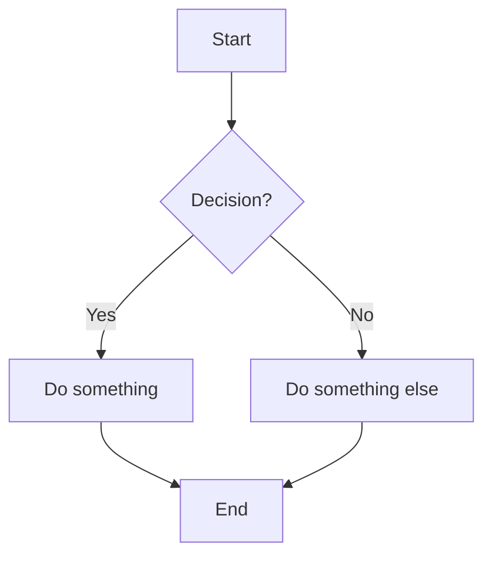
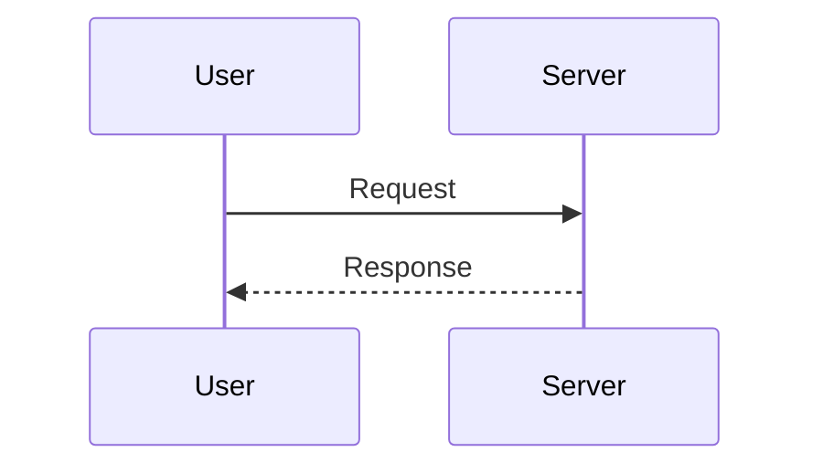
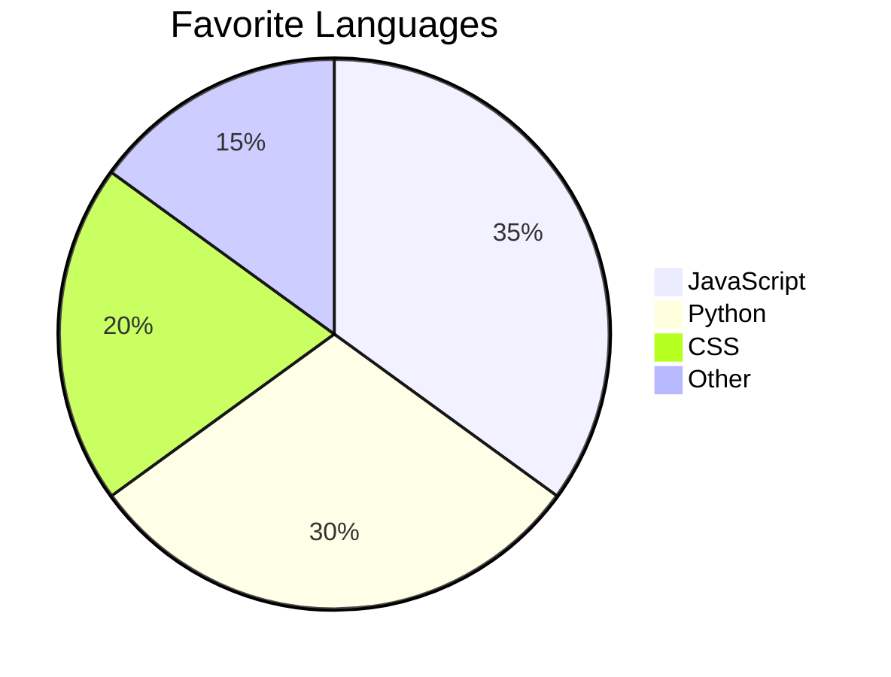

# Markdown Formatting Showcase

## Table of Contents

- [Headings](#headings)
- [Text Formatting](#text-formatting)
- [Links](#links)
- [Images](#images)
- [Lists](#lists)
- [Blockquotes](#blockquotes)
- [Code](#code)
- [Tables](#tables)
- [Horizontal Rules](#horizontal-rules)
- [Task Lists](#task-lists)
- [Footnotes](#footnotes)
- [Definition Lists](#definition-lists)
- [Escaping Characters](#escaping-characters)
- [HTML in Markdown](#html-in-markdown)
- [Math (LaTeX)](#math-latex)
- [Mermaid Diagrams](#mermaid-diagrams)

---

## Headings

# Heading 1
## Heading 2
### Heading 3
#### Heading 4
##### Heading 5
###### Heading 6

Alternative Heading 1
=====================

Alternative Heading 2
---------------------

---

## Text Formatting

### Emphasis

*Italic text* or _italic text_

**Bold text** or __bold text__

***Bold and italic*** or ___bold and italic___

~~Strikethrough text~~

==Highlighted text== *(some renderers)*

### Superscript & Subscript

H~2~O (subscript, some renderers)

X^2^ (superscript, some renderers)

### Special Text

> **Note:** Some renderers support `<sub>` and `<sup>` HTML tags:
> H<sub>2</sub>O and X<sup>2</sup>

---

## Links

### Inline Links

[Visit Google](https://www.google.com)

[Link with title](https://www.google.com "Google Homepage")

### Reference Links

[Google][1]
[GitHub][gh]

[1]: https://www.google.com
[gh]: https://github.com "GitHub"

### Autolinks

<https://www.example.com>

<someone@example.com>

### Anchor Links (Internal)

[Jump to Headings](#headings)

---

## Images

### Inline Image


### Reference Image

![Alt text][img1]

[img1]: https://via.placeholder.com/200x80 "Reference image"

### Image as Link

[](https://www.example.com)

---

## Lists

### Unordered Lists

- Item 1
- Item 2
  - Nested item 2a
  - Nested item 2b
    - Deep nested item
- Item 3

Alternative markers:

* Asterisk item
* Another asterisk item

+ Plus item
+ Another plus item

### Ordered Lists

1. First item
2. Second item
   1. Nested numbered
   2. Another nested
3. Third item

### Ordered List (all same number — auto-increments)

1. First
1. Second
1. Third

### Mixed Lists

1. Ordered item
   - Unordered sub-item
   - Another sub-item
2. Another ordered item
   1. Numbered sub-item
      - Unordered deep item

### List with Paragraphs

1. First item with a paragraph.

   This is a continuation paragraph under the first item.

2. Second item.

---

## Blockquotes

> This is a blockquote.

> Multi-line blockquote.
> It continues on the next line.

> **Nested blockquotes:**
>
> > This is a nested quote.
> >
> > > And even deeper nesting.

> ### Blockquote with other elements
>
> - Item inside a quote
> - Another item
>
> *Italic* and **bold** work inside quotes too.
>
> ```
> code blocks work too
> ```

---

## Code

### Inline Code

Use the `printf()` function. Escape a backtick with `` `code` ``.

### Fenced Code Blocks

```
Plain code block (no language specified)
Just raw text here.
```

```python
# Python
def hello(name: str) -> str:
    """Greet someone."""
    return f"Hello, {name}!"

print(hello("World"))
```

```javascript
// JavaScript
const greet = (name) => {
  console.log(`Hello, ${name}!`);
};

greet("World");
```

```css
/* CSS */
.container {
  display: grid;
  grid-template-columns: repeat(auto-fit, minmax(250px, 1fr));
  gap: 1rem;
  container-type: inline-size;
}
```

```html
<!-- HTML -->
<div class="card">
  <h2>Title</h2>
  <p>Some content here.</p>
</div>
```

```bash
# Bash
echo "Hello, World!"
for i in {1..5}; do
  echo "Count: $i"
done
```

```json
{
  "name": "Markdown Showcase",
  "version": "1.0.0",
  "features": ["headings", "lists", "code", "tables"]
}
```

```sql
SELECT users.name, COUNT(orders.id) AS order_count
FROM users
LEFT JOIN orders ON users.id = orders.user_id
GROUP BY users.name
HAVING order_count > 5
ORDER BY order_count DESC;
```

```diff
- This line was removed
+ This line was added
  This line is unchanged
```

### Indented Code Block

    This is an indented code block.
    Four spaces or one tab at the start.
    No syntax highlighting available.

---

## Tables

### Basic Table

| Column 1 | Column 2 | Column 3 |
|----------|----------|----------|
| Row 1    | Data     | Data     |
| Row 2    | Data     | Data     |
| Row 3    | Data     | Data     |

### Aligned Table

| Left Aligned | Center Aligned | Right Aligned |
|:------------|:-------------:|--------------:|
| Left        |    Center     |         Right |
| Text        |    Text       |          Text |
| More        |    More       |          More |

### Table with Formatting

| Feature       | Syntax           | Rendered             |
|:-------------|:----------------|:--------------------|
| Bold          | `**bold**`       | **bold**             |
| Italic        | `*italic*`       | *italic*             |
| Code          | `` `code` ``     | `code`               |
| Link          | `[text](url)`    | [text](https://example.com) |
| Strikethrough | `~~strike~~`     | ~~strike~~           |

---

## Horizontal Rules

Three or more of hyphens, asterisks, or underscores:

---

***

___

---

## Task Lists

- [x] Completed task
- [x] Another completed task
- [ ] Incomplete task
- [ ] Another incomplete task
  - [x] Nested completed subtask
  - [ ] Nested incomplete subtask

---

## Footnotes

Here is a sentence with a footnote.[^1]

Here is another with a named footnote.[^note]

[^1]: This is the first footnote content.
[^note]: This is the named footnote. It can contain **formatting** and even multiple paragraphs.

    Indent to include additional paragraphs in a footnote.

---

## Definition Lists

*(Supported by some renderers like GitHub, PHP Markdown Extra)*

Term 1
: Definition for term 1

Term 2
: First definition for term 2
: Second definition for term 2

Complex Term
: A definition that includes `inline code`, **bold text**, and
  even a [link](https://example.com).

---

## Escaping Characters

Use a backslash to escape special characters:

\* Not italic \*

\# Not a heading

\[Not a link\](https://example.com)

\> Not a blockquote

Escapable characters: \\ \` \* \_ \{ \} \[ \] \( \) \# \+ \- \. \! \|

---

## HTML in Markdown

Most renderers allow inline HTML:

<details>
<summary>Click to expand (collapsible section)</summary>

This content is hidden by default.

- You can include **markdown** inside HTML blocks
- But some renderers require a blank line before markdown content

</details>

<kbd>Ctrl</kbd> + <kbd>C</kbd> — Keyboard keys

<mark>Highlighted text using HTML</mark>

<abbr title="HyperText Markup Language">HTML</abbr> — Abbreviation

Text with <sup>superscript</sup> and <sub>subscript</sub>

<dl>
  <dt>HTML Definition List</dt>
  <dd>Works in most renderers</dd>
</dl>

<div align="center">
  <strong>Centered content using HTML</strong>
</div>

---

## Math (LaTeX)

*(Supported by GitHub, GitLab, Jupyter, and many other renderers)*

### Inline Math

The formula $E = mc^2$ is well known.

The quadratic formula is $x = \frac{-b \pm \sqrt{b^2 - 4ac}}{2a}$.

### Block Math

$$
\sum_{i=1}^{n} i = \frac{n(n+1)}{2}
$$

$$
\int_{0}^{\infty} e^{-x^2} dx = \frac{\sqrt{\pi}}{2}
$$

$$
\begin{bmatrix}
a & b \\
c & d
\end{bmatrix}
\times
\begin{bmatrix}
e \\
f
\end{bmatrix}
=
\begin{bmatrix}
ae + bf \\
ce + df
\end{bmatrix}
$$

---

## Mermaid Diagrams

*(Supported by GitHub, GitLab, and other platforms)*







---

## Emoji

*(Supported by GitHub, Slack-style markdown, and many renderers)*

:smile: :rocket: :tada: :warning: :x: :white_check_mark:

Or use Unicode directly: 😄 🚀 🎉 ⚠️ ❌ ✅

---

## Line Breaks

End a line with two spaces  
to create a line break within a paragraph.

Or use a backslash\
for a line break (CommonMark).

Or use `<br>` for an HTML break.<br>Like this.

A blank line creates a new paragraph.

Like this one.

---

## Comments (Hidden Text)

<!-- This is a comment. It won't be rendered. -->

[//]: # "This is also a comment using a reference-style link trick."

[comment]: <> (Another comment style)

---

*End of Markdown Formatting Showcase*
 
